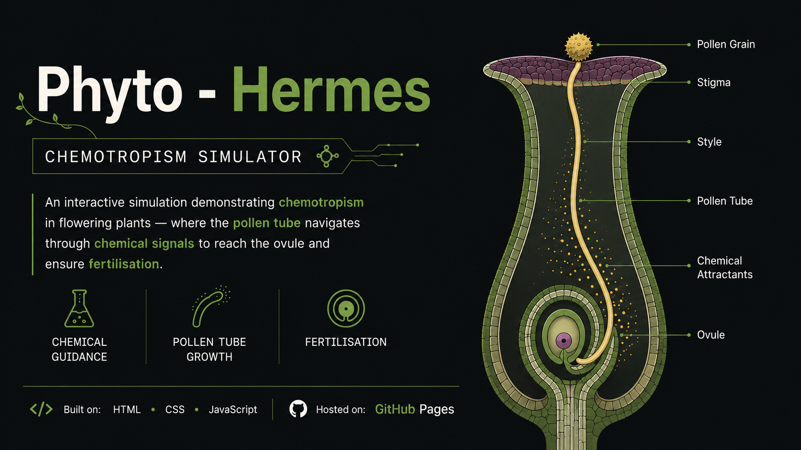

# Phyto - Hermes 🧪

  

A clean, interactive educational web simulation modeling chemotrophism during angiosperm fertilization. Visualize how chemical attractants released by the ovule guide pollen tube growth toward the embryo sac for successful double fertilization.

---

## ✨ Features

* **Pollen Germination:** Launch a pollen grain onto the stigma and observe pollen tube initiation.
* **Chemotropic Guidance:** Visualize pollen tube growth directed by chemical attractants released from the ovule.
* **Interactive Controls:** Progress through each stage of pollen tube growth and fertilization with intuitive controls.
* **Double Fertilization:** Observe the transport and release of two male gametes into the embryo sac.
* **Scientific Visualization:** Explore the sequence of chemotrophic guidance in a clean, interactive environment.
* **Reset Functionality:** Instantly restart the simulation to explore different scenarios.

---

## 🚀 Built With & Hosted On

* **Repository:** GitHub
* **Hosting:** GitHub Pages

---

## 🛠️ Credits & Acknowledgments

* **Claude Fable:** Code Architecture
* **Replit:** Debugging & Enhancement
* **OpenAI:** Debugging & Rectified Prompt Generation

---

## 👤 Author

* **Draven Ashcroft**
  * M.Sc. Ag. Entomology, ASRB NET
  * DIPS Chain Of Institutions
